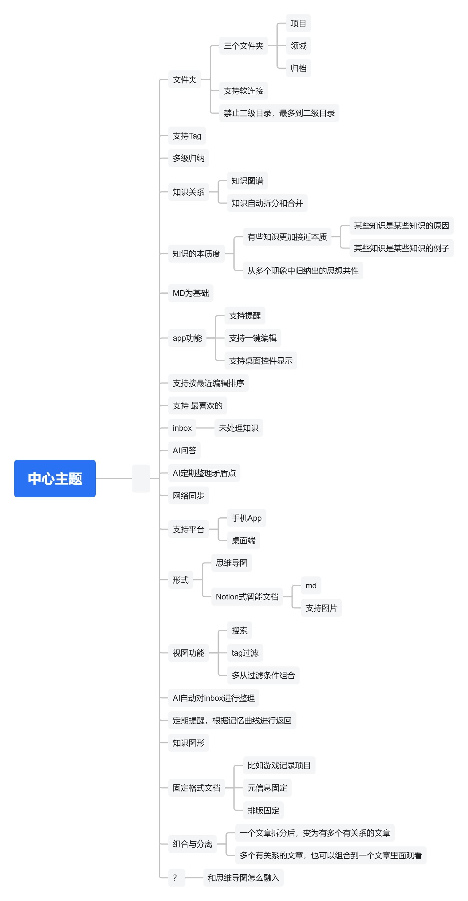

# 初始需求草图

## 项目定位

一个面向个人知识管理的“第二大脑”产品。简单来说，它首先是一个笔记软件。

## 原始设想

当前输入包含一张思维导图，涉及文件夹、标签、归纳、知识关系、Markdown、提醒、编辑、桌面组件、排序、收藏、Inbox、AI 问答、AI 整理、同步、多端、思维导图、智能文档、搜索筛选、知识图谱、固定格式文档，以及内容组合与拆分等方向。

这些内容目前仅作为需求发现阶段的输入，不代表已确认范围或实现承诺。

## 已确认需求

- [笔记双视图需求：思维导图与 Markdown](./dual-view-notes.md)
- [记忆整理](./memory-organization.md)
- [数据可迁移原则](./data-portability.md)
- [ZFY Markdown 格式](./markdown-format.md)
- [思维导图与语义关系存储格式](./mindmap-storage.md)
- [知识组织方式](./knowledge-organization.md)
- [多级摘要](./multi-level-summaries.md)
- [文档移动与路径更新](./path-updates.md)
- [分层知识图谱与文档地图](./hierarchical-knowledge-graph.md)
- [AI 知识管理员](./ai-knowledge-manager.md)
- [多端同步、离线使用与冲突边界](./multi-device-sync.md)
- [笔记模板](./note-templates.md)：仅提供创建起点，不持续约束文档字段和排版。
- [安卓今日 Inbox 桌面控件](./android-inbox-widget.md)：今日列表、快速新建与简单编辑。

## 已确认延后的进阶功能

候选想法统一保存在[进阶想法池](../advanced-ideas.md)，不代表承诺实施或自动进入下一期。

- 第一期不实现进阶冲突 diff 对比界面及 AI 冲突合并；冲突继续简单二选一。
- 第一期不实现普通事项提醒、文档回顾提醒、周期提醒及间隔复习。
- 既有的版本记录、修改审计、必要系统通知和每日记忆整理不受影响。

这里只记录已明确延后的功能，不代表其他需求都已承诺在第一期实现；整体版本范围仍待后续对齐。

## 待对齐

- 目标用户与最核心使用场景
- 第一阶段必须解决的问题
- MVP 功能边界与优先级
- 云端部署、账号及同步服务的具体形态
- 桌面端和手机端的具体操作系统支持范围
- 技术栈与系统架构
